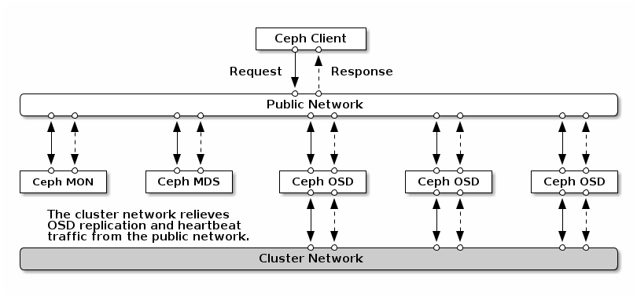
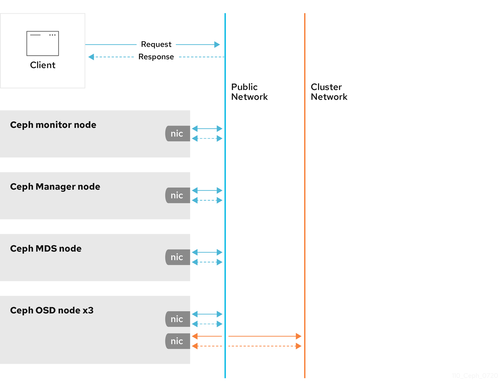

# cephadm_ansible


### Cephadm Ansible Project

* This project aims to automate the installation and configuration of a Ceph storage cluster using Ansible. The playbook is designed to perform the following tasks:





* 1. Check if the ceph.conf file already exists on the mon1 host.
* 2. Create a new ceph.conf file with specific configurations for the Ceph cluster.
* 3. Bootstrap the Ceph cluster on the mon1 host using cephadm.
* 4. Add MON (Monitor) hosts to the Ceph Orchestrator and apply the MON role.
* 5. Add the "mon" label to each MON host in the cluster.
* 6. Apply the MON role to a specified number of MON hosts.
* 7. Copy the ceph.pub key to remote hosts to enable passwordless SSH access.

### Prerequisites

Before running the playbook, ensure the following requirements are met:

* 1. Ansible is installed on the system from where you plan to run the playbook.
* 2 SSH access to all the target hosts is properly configured, and the SSH key has been added to the mon1 host to enable passwordless SSH access to remote hosts.
* 3. The `mon_hosts` list is defined in the Ansible inventory file (inventory) with the MON hostnames or IP addresses.

### Playbook Structure

The `playbook.yml` file contains the main Ansible playbook with the tasks to be executed. The tasks include conditional checks to prevent redundant operations and ensure idempotence.


## How to Run the Playbook
To run the playbook, execute the following command:

* Note: don't forget to change variable

```
---
# defaults file for cephadm_ansible
docker_enabled: true
podman_enabled: false


## bootstrap
bootstrap_manager: true

## mon1
mon1: ""172.16.112.110"

## one interface
mon_ip: "172.16.112.110"

## cluster network
public_network: "172.16.112.0/22"
cluster_network: "172.20.104.0/24"

## adding mon
mon_hosts:
  - mon2
  - mon3

## adding OSD
ceph_hosts:
  - ceph1
  - ceph2
  - ceph3

```


```bash

ansible-playbook -i inventory playbook.yml --tags preinstall

ansible-playbook -i inventory playbook.yml --tags bootstrap

ansible-playbook -i inventory playbook.yml --tags adding_mon

ansible-playbook -i inventory playbook.yml --tags adding_mgr

ansible-playbook -i inventory playbook.yml --tags adding_osd

```

### License

This project is licensed under the MIT License. You are free to use, modify, and distribute this project as per the terms of the MIT License.

Disclaimer: This project is provided as-is and without warranty. Use it at your own risk. The author is not responsible for any damages or issues resulting from the use of this project.

